# **In the name of Allah the Merciful**

# Week 3 - Memory Types, Segments, and Management

## Week Objectives
> - Analyze the components of a program's memory space for both code and data regions  
> - Write C programs to define data in different memory regions  
> - Interpret application's map and linker files   
> - Use GCC binary utilities to investigate the memory usage of an executable  
> - Investigate the map file for the memory usage for an executable  
> - Determine where compiled code and data symbols are allocated, the lifetime of these symbols and the access restrictions  

## Table of Contents
* [Introduction to Memory Organization](#--)
* [Memory Architectures](#--)
* [Memory Segments](#--)
* [Data Memory](#--)
* [Special Keywords (Const, Extern, Static)](#--)
* [The Stack](#--)
* [The Heap](#--)
* [Code Memory](#--)

## Introduction to Memory Organization
- Memory is a key component in embedded systems and generally in all computer systems, but in embedded systems, memory is also one of the major limited resources we have
- The fundamental building block of memory is the *bit*, a bit can store one piece of boolean information (either one or zero)
- Typically, 8 bits make up a *byte*, bytes are usually the minimum unit we can access in hardware.
- Embedded systems have very small amounts of memory (from kilobytes to a few megabytes), that's why it's crucial to utilize and organize memory efficiently in embedded systems
- Embedded systems contain many memory architectures, each type of them is usually a different kind of technology, different types have varying:
  - Capacities
  - Power
  - Speed/latency
  - The way data is stored
  - Volatility
  - Lifetime
  - Transaction size (data width)
  - Price
- Because of the previous note, systems are usually designed with a mixture of different memories. The memory system can be thought of as a pyramid as shown in the following picture, the top is the most expensive but fastest (lowest latency) memory and smallest capacity, the pyramid bottom is the most cheap but slowest and largest capacity
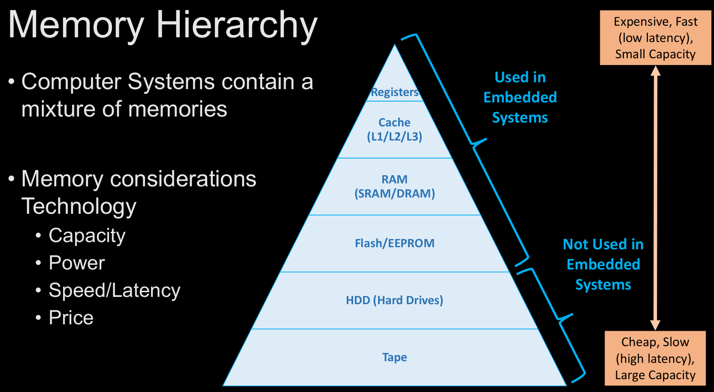

- Chipset vendors usually design multiple chips in a sub-family series all with varying amounts of memory (these memories do not typically list the peripheral or register memory, it's just the flash and RAM memories that vary in the sub-family), consider the following example:
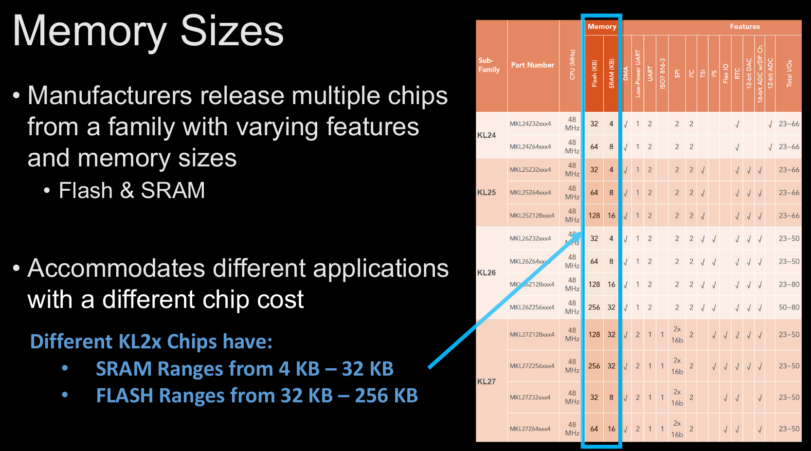

- From the above picture, we notice that usually the RAM memory is smaller than flash, this is because the flash memory contains the *program code* and SRAM contains the *program data* which is always smaller in size than the code itself as program data is typically overwritten during the many iterations of the program.
- When choosing the microcontroller, we should do some amount of effort to properly determine the required memory size and figure out the suitable memory footprint.
- In the previous week, we knew that memory plays an important role in the build and address allocation processes, we knew that the build system requires some information regarding the **architecture** (CPU architecture) and the **platform** (the microcontroller platform) as well as a description of what memory regions are that is provided in the linker script.
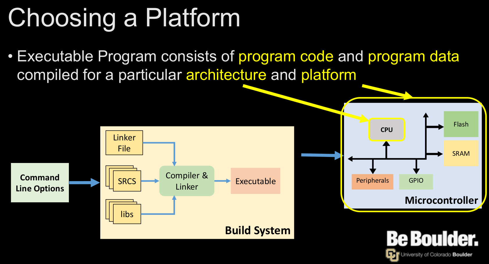

- Memory is used to store all of the program code, program data and the runtime state of the program, the linker script is the file responsible for providing the information (memory map) about the segment and sub-segment code to memory mapping.
- In other words, linker script purpose is:
  - To describe how the sections in the input files should be mapped into the output file
  - To control the memory layout of the output file.
- The flash and RAM memory need some type of dedicated controller to configure, read, and write data (these controllers are usually built into the microcontroller and communicate to the CPU via an internal bus)
- We may want to extend the memory by using an external EEPROM which can store both non-volatile code and data memory, usually EEPROM communicates with the processor using SPI protocol.
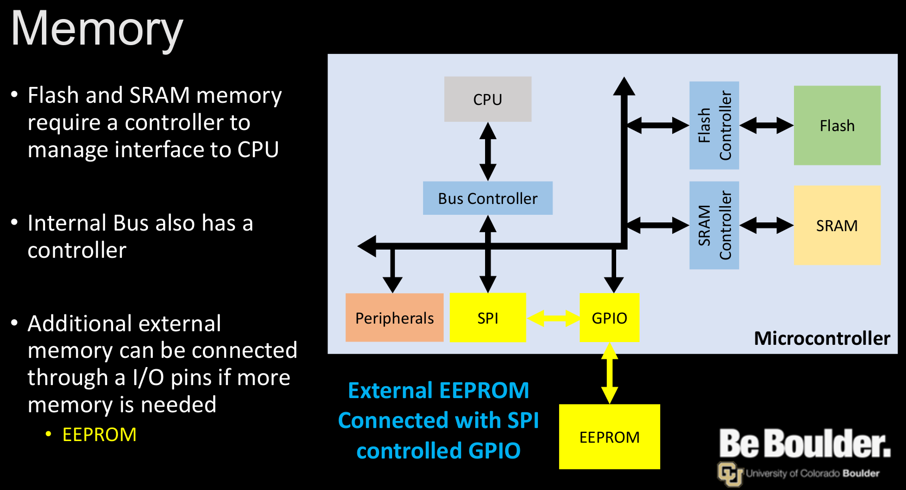

- In addition to code and data memory, we have runtime data that are varying throughout the program, this kind of data is stored and accessed by *register memory* and this memory lives all over the microcontroller (we usually have registers in peripherals, CPU, ...)
- Generally, registers hold data that is used by the CPU and the peripherals to store runtime information or the state of the program, however these are a few registers.
- The CPU registers (general or special purpose) are a key component to how the microcontroller performs an operation.
- General purpose registers store the CPU instructions, and the operands of the operation
- Special purpose registers dictate the state of the program (e.g.: the current instruction, the program counter, ...), they also may be more internal registers that are not accessible to the programmer.
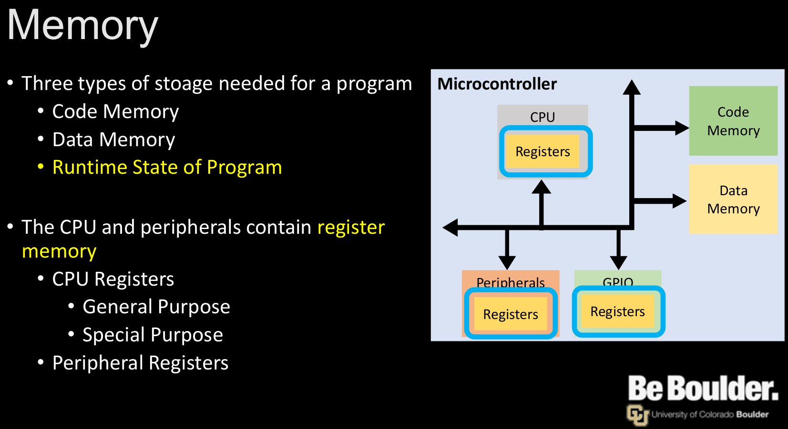

- The faster we want the memory to be, the closer to processor we need to place (i.e.: registers and cache memories are the closest from CPU due to their high speed)
- We usually build a hierarchy of memory systems to help achieving our requirements
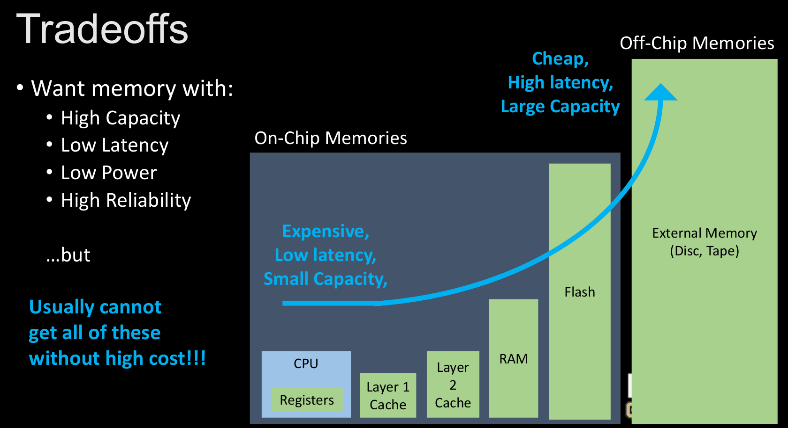

## Memory Architectures
- Memory is usually modeled as a long 2D-array, each row index represents a different memory address and each column index represents different bytes
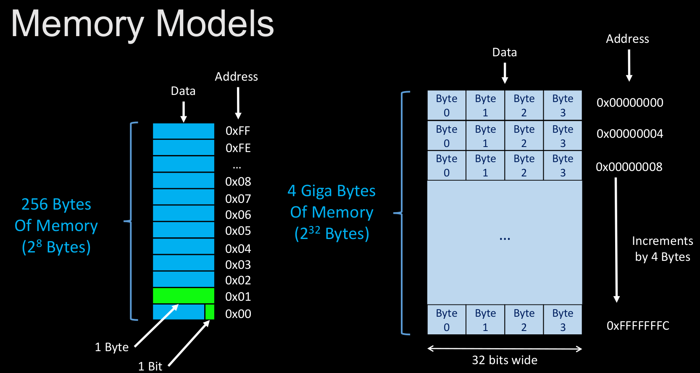

- Data is read or written to memory based on some types of protocols or handshaking, this handshaking is managed by a *memory controller* that interfaces between the memory and the CPU
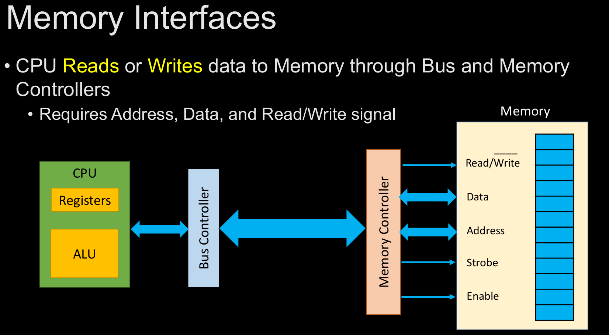

- We now discuss the features of memory in more details, those features are:
  - Capacity
  - Volatility
  - Write endurance
  - Memory access
  - Latency
  
### Capacity
- Capacity is the amount of storage a memory can hold
- Our desire to increase memory capacity doesn't mean that with high capacity the system will be improved in performance or quality
- More memory capacity means more design complexity and more physical size which ofcourse leads to more power consumption and price
- That's why we don't need larger capacities for small apllications, but when we work on complex applications with embedded OS, it is crucial to increase memory capacity to do the job.

### Volatility
- It is the ability of memory to store data without power
- We have 2 types of memory:  
| Test           | Volatile                                                        | Non-volatile                                          |  
| -------------- | :-------------------------------------------------------------: | ----------------------------------------------------: |  
| Characteristic | it requires power to store data and loses data when power-off   | it keeps the data stored when the power is removed    |  
| Examples       | RAM and most registers                                          | ROM and flash                                         |  

### Write Endurance
- Non-volatile memories have a limited number of write-erase cycles before failure, meaning that they can't be programmed for infinite number of times 
- Flash has an endurance lasting from 10000 to 100000 write-erase cycles, newer technologies may have higher cycles but endurance still remains an issue.
- Cloud storage has begun to shift towards large flash arrays because of its improved endurance and high speed compared to disk or tape.

### Memory Access
- Random access: the ability to access any part of memory given the address of that location (example: RAM)
- Random access is very convenient for data that need to change regularly like the program data
- However, reducing the access to certain types of memory is desireable as we want some other data to be protected from being overwritten just as the program code 
- Since ROM is read only memory, it can protect the data we want as ROM needs extra permissions to modify or overwrite its data, thus providing security for the software and also safety for potential errors with overwriting
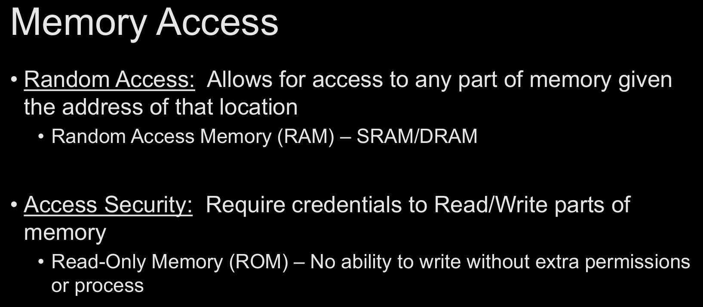

- Memory consists of blocks, each block consists of multiple pages, each page contains multiple bytes
- RAM allows access down to the byte level, as for some flash based memories they don't allow for random access of data, instead they access the pages.
- Flash **erasing** happen at the block level (not the page level)
- Because of this it its necessary that we build some technology around flash to cache information into registers in order to reduce frequently reading or writing information which in turn helps us reducing memory latencies
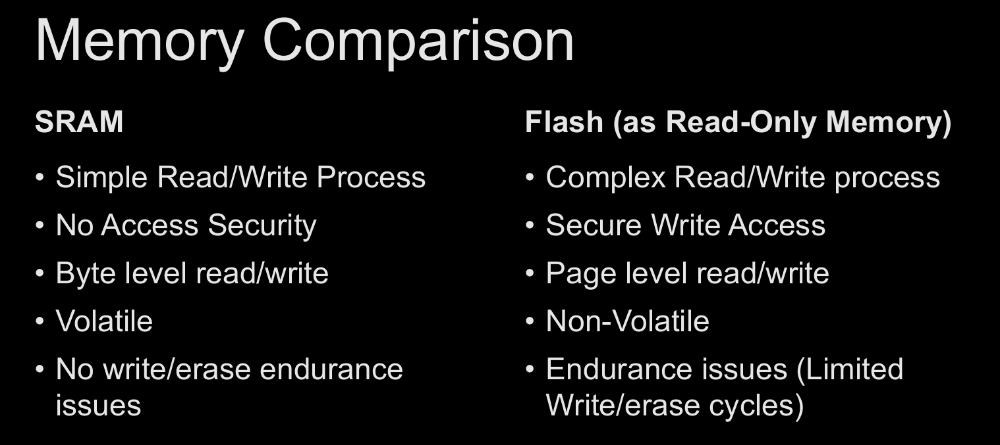

### Latency
- It's the time it takes for memory to respond to a read/write request
- We know that for each instruction the CPU make its *fetch/decode/execute* process, we want this process to be as fast as possible in order not to cause delay in our application.
- We can further reduce memory latency by using the technology of pipelining (specially in cache), many microcontrollers are now supporting pipelining for that reason.
- A cache is a type of memory to help reducing the time it takes to read/write data from/to the CPU as it's faster than RAM.
- Cache memory may not exist in the simple and cheap microcontrollers. However, more advanced ARM processors like the ARMv8A contain multi-level cache systems
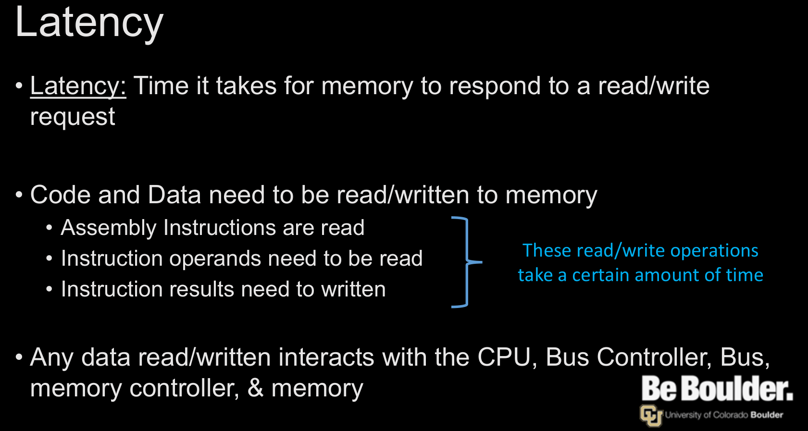

## Memory Segments
- As we already know, embedded systems contain different physical memories:
  - Flash: usually contains the code memory
  - SRAM: contains data memory
  - Registers: help configuring and tracking the state of the peripheral or CPU
  - External memory: we may have it if we need to extend our memory space
- The *linker* is the process that is responsible for taking the high level program and separating it out onto multiple components, each one is installed on a different section on the pyhysical memory, so programs need to know some details about these memories before they can be installed and executed.
- Before we proceed, we want to distinguish between a *patform* and an *architecture*.
  - A platform is the underlying integrated circuit and the components surrounding the CPU (i.e.: the microcontroller itself), it also may refer to an OS. The compiler is **platform independent**
  - An architecture or (target architecture) is the CPU architecture. The compiler is **architecture dependent**
  - However, *linkers* cannot be platform independent as they must have information about the memory space of the platform in order to be able to combine the multiple object files into a single executable, this executable is then mapped into physical memory of the system by the *locating* process.
  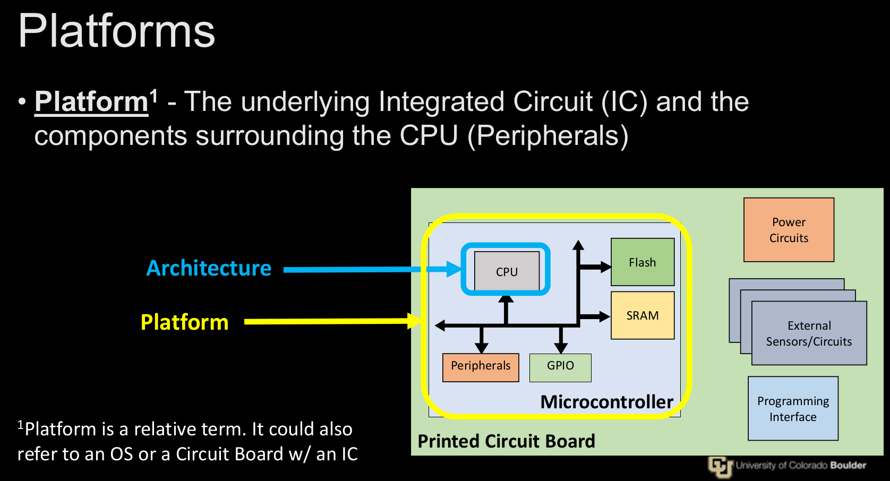
  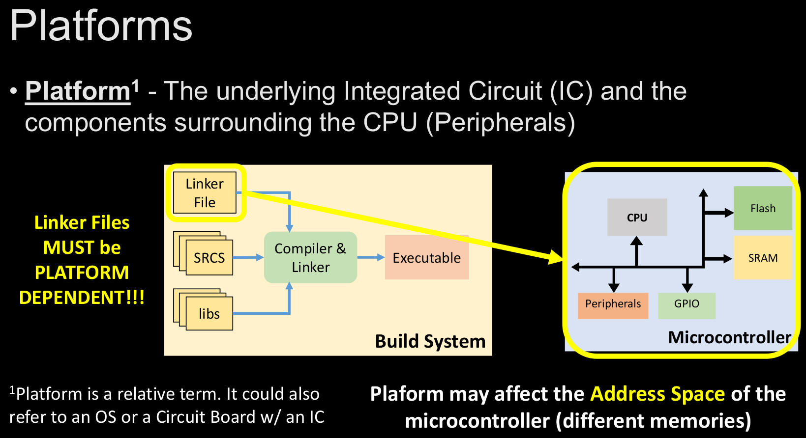

- Memories are placed in physically different parts of the platform, but are accessed in the same way
- One way to organize these memories is to use a *memory map*, it provides us a way to map different segments and sub-segments to the target memory. These are mapped by assigning certain addresse range for each segment in the address space (i.e.: code, data, system configuration, device information, and peripheral functionality are all **represented into different segments but in one address space**)
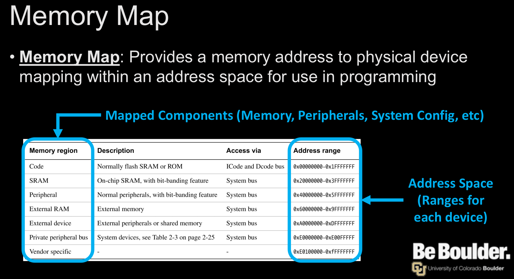

- However, the general and special purpose registers have their own address space and access method (through *register memory*)
- An example of register memory and the associated segments in the ARM Cortex m architecture is shown below:
  - The processor has specific rules about how general purpose and special purpose registers in the CPU are used
  - Nearly all operations in the CPU utilize the **general purpose registers** to hold operands or the inputs and outputs of an operation that is specified in the assembly code. In our examples we have R0-R12 general purpose registers
  - The status and progress of the program operations are stored in the **special purpose registers**, these registers are accessed via special keywords in assembly. Special purpose register are the stack pointer, program counter, link register, ...
  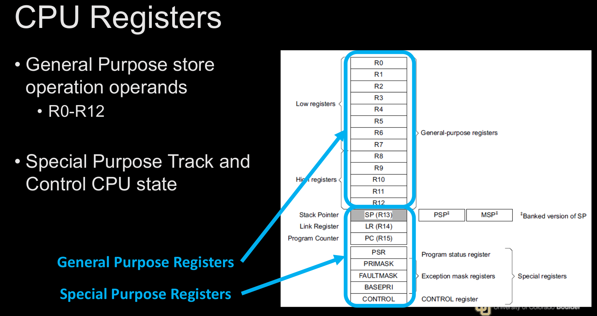

- To further complicate the usage of special purpose registers, different architectures like AVR may use keywords to interact with these registers
- The instantaneous values of these registers change regularly as the program processes the instructions and data of the program
- Compiler needs to know how to manipulate these registers at compile time to make sure the process and interactions with these registers coincide with the architecture's application binary interface (ABI).
- We mentioned ABI earlier in week 2 when we were talking about the toolchain. ABI gives rules on how a compiler will perform the translation from high level language to the architecture specific machine code, this includes details on how to appropriately use the CPU and its registers.

- Different chipsets that in the same microcontroller family use the same CPU architecture but with varying amounts of platform capability like more peripherals, different memory sizes, or more advanced system control.
- The addresses of memory segments may be kept consistent across different chips in the same family, but do not guarantee these memories mainatin the same addresses. This consistency allows the compiler to represent these segments in a unified mechanism
- This means that the compiler doesn't need to know anything related to the platform itself, it just needs the addresses that it needs to read and write to access the peripherals (not the physical addresses, just virtual addresses which can be handled using **pointers**)
- This memory map is provided in the linker script.
- As for the register memory, we also need to map between the code and these platform specific registers at compile time, this occurs in something called *register definition file* which allows address translation for external CPU segments to occur before linking.
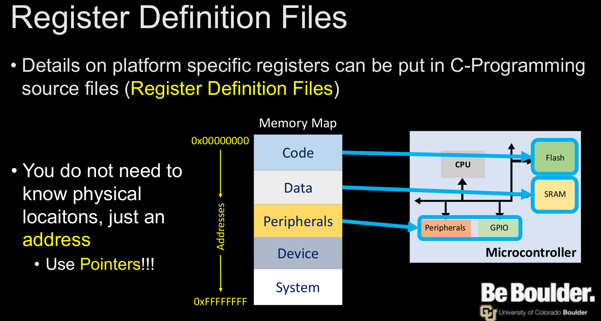

- The linker file provides information to the compilation process about how an executable is to be installed into a platform
- To prevent inconvienience, lets simply compare between the memory map and linker file:
  - Memory map: allows access to the platform through addresses.
  - Linker file: provides physical addresses to symbol mapping.
- By using symbols and offsets, code and data sections can be moved around easily and represented by a generic subsegment name as shown in the following picture:
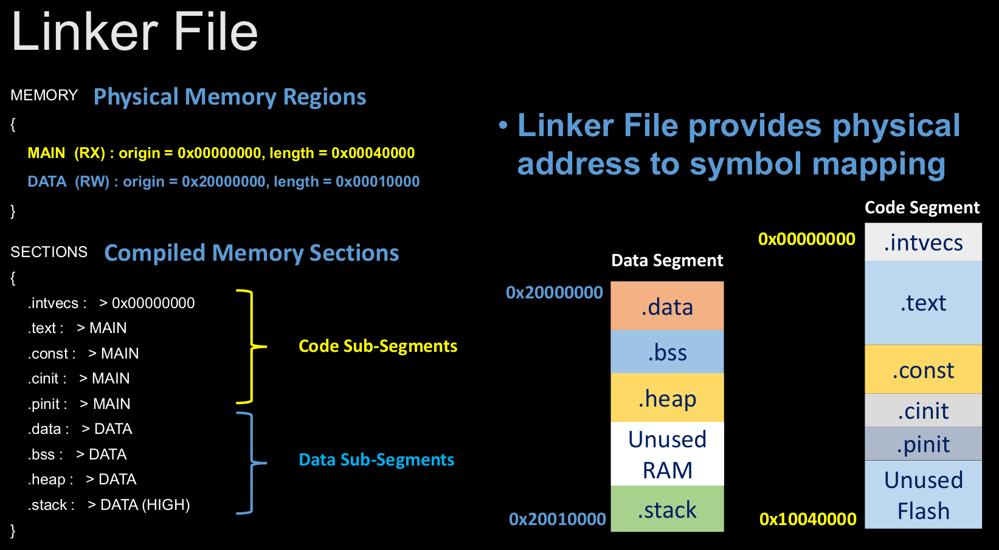

- Then the locator takes these generic sections and gives them real addresses within a larger segment:
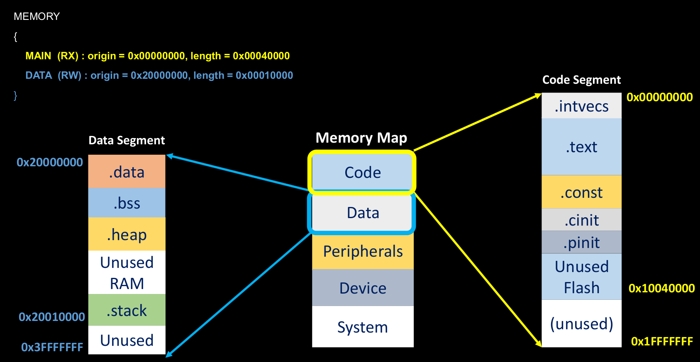

- Ofcourse different applications use varying amounts and sizes of the code and data segments, but any leftover memory in the specified segments just stay unused.
- In linker file, we have a list of **memory segments (memory regions)** and **memory sections (or memory subsegments)**
- Some typical data subsegments are: stack, heap, .data, and .bss
- Some typical code subsegments are: interrupt vectors (.intvecs), .text, .const (or .rodata), and the bootloader
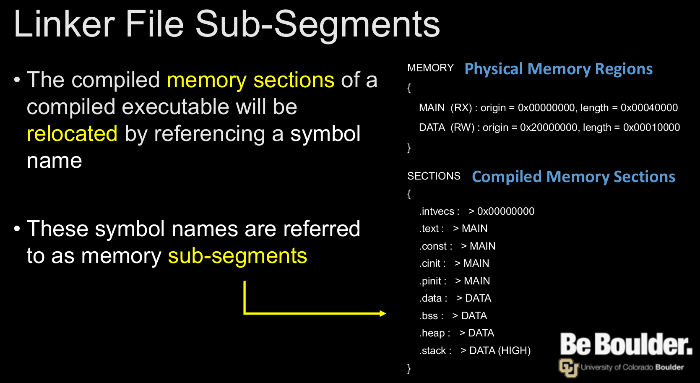

- In the remaining discussion, we will dive more deeply into the data and code sections.

## Data Memory
- Data memory is the container for the various types of allocated data that get mapped into physical memory
- Variables, derived data types such as pointers and structures, and arrays get stored in data memory.
- The contents of data memory regularly change throughout the program's execution, data is *loaded* from memory to CPU registers and is *stored* from registers to memory
- Some data are allocated in compile time, some others allocated in runtime.
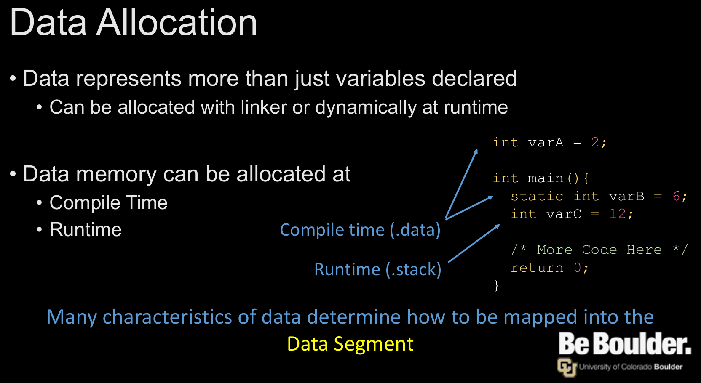

- Data memory is broken up to 4 main subsegments, each varies with size depending on the program:
  - Stack
  - Heap
  - .data
  - .bss (block started by symbol)

- The stack stores temporary data in most local variables
- Heap stores dynamic data at runtime
- .data region stores non-zero initialized global and static data
- .bss stores zero initialized and uninitialized global and static data
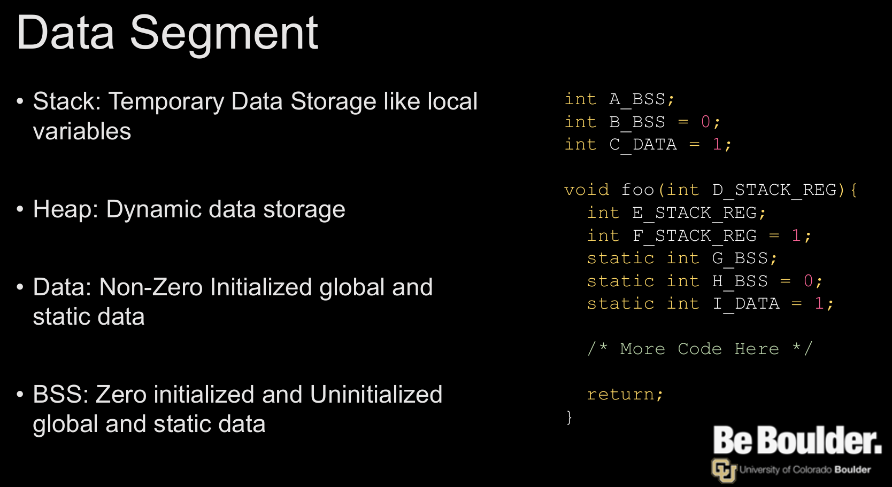

- Consider the following linker script:
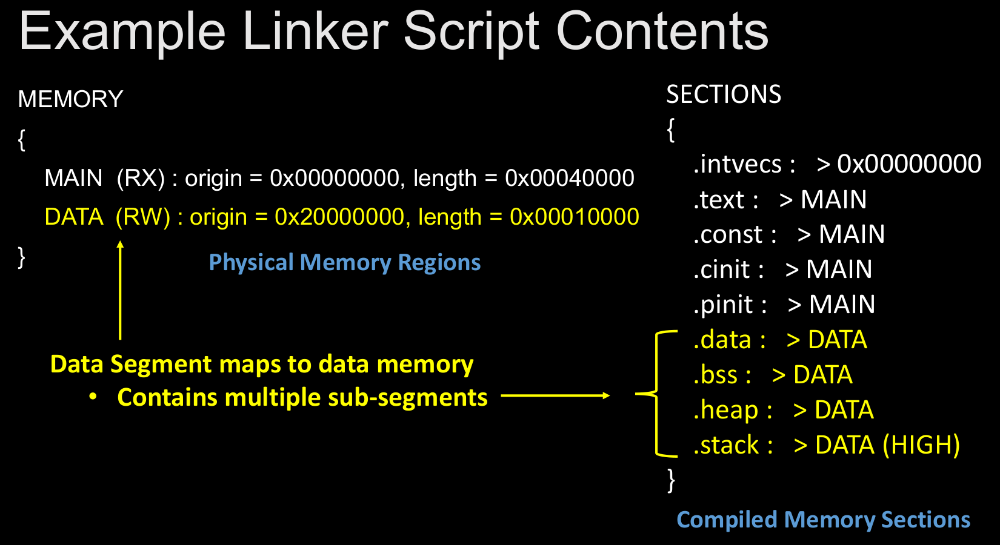

- The "DATA" segment (region) specified in the file maps the physical data region of RAM type memory and have a length of 64 KB (0x0001000 = 64 KB)
- Without carefully managing these data subsegments (sections), data will be easily corrupted by mis-addressing a variable or writing outside the bound of the subsegment space, so take care while working with linker scripts.
- The linker script also specifies in what order the data subsegments will be placed so that each subsegment has boundaries given either by a *linker flag* or by the size of the memory we allocated. This order is the order of the subsegments in the "SECTIONS" region in the linker file.
- The same applies on the "CODE" segment
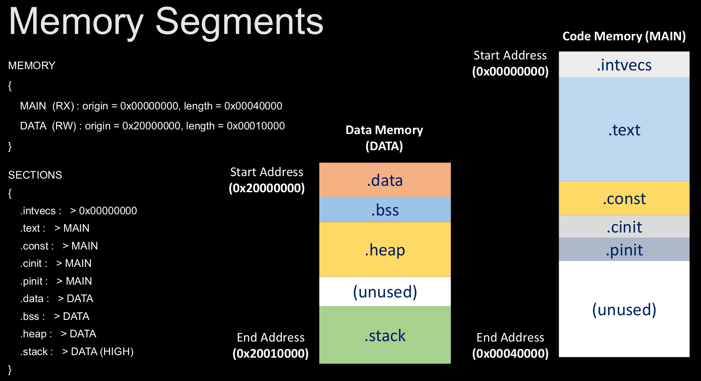

- It's highely likely that not all the memory will be allocated at compile time, this will leave some leftover memory **unsued** for our program.
- As we can see from the example in the above picture, data subsegments are allocated contiguously starting from the *origin* of addresses and going for the *length* of the memory, except for the stack as it starts from the end of memory region (highest address) and it grows towards the lower addresses as more data gets added to it. This type of stack is specified as **"full descending stack"**
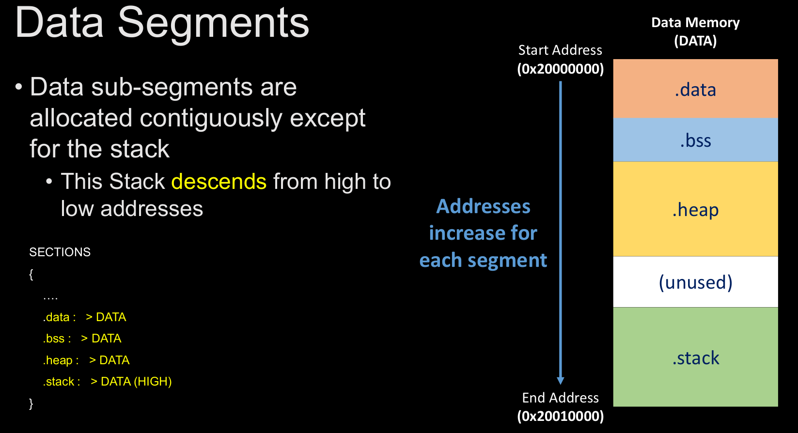

- There are many different characteristics that variables can have throughout the program:
  - Size
  - Access
  - Scope
  - Location
  - Creation time (allocation time)
  - Lifetime
- We can allocate and manage our data with some specific C keywords, or with *compiler attributes*, there are also some runtime routines that help us allocate data at runtime
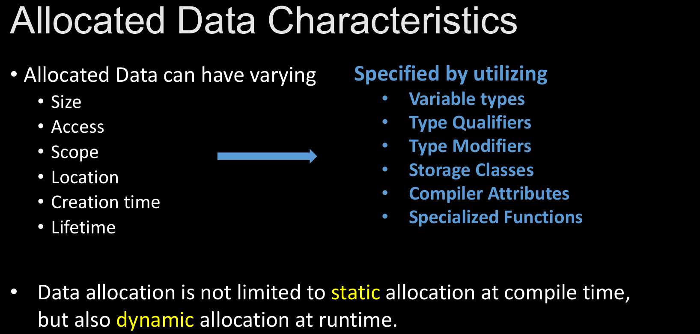

- Data sizes are architecture and compiler dependent, the C standards specifies the minimum size that some types must be, but the compiler and the architecture can manipulate types differently
- Lifetime and scope of data are somewhat related to each other, there are 3 forms of lifetime:
  - Data exist for a lifetime of the function or block in which it's inside
  - Data exist for a lifetime of the program
  - Data exist for a longer time than a function lifetime and less than the program lifetime
  
- Most local variables only exist for the length of the function or block, then when the function returns, they are destroyed. These variables have also *local scope* which means that they are only accessible inside the funtion. The memory that these variables occupy is reused by the other functions after the existing function returns.
- The only local variables that are exception from the latter note is those which are created with the `static` keyword. We will discuss it further in the next lesson.
- Global variables are that **get allocated at compile time**, they've the lifetime of the entire program and are never destroyed, which means that the occupied memory can never be reused during the program runtime, they also have *global scope* so that they are accessible by other parts of the program
- Dynamically allocated data are the data that can live for a longer time than a function and less than a program, these data require a special routine to **allocate and free data an runtime**. There are many issues of managing dynamic memory but it can provide us the ability to access data outside of a local scope

- One issue with data memory is that data is stored in RAM, meaning that this data it's lost when power is off causing loss in the state and important processes of the program. We can solve this problem by storing important data in the Flash as it's non-volatile memory, but it's difficult and also slow to write data into flash during the execution of the program, so we use the external EEPROM to store the data that needs to be retained if the power is shutdown.
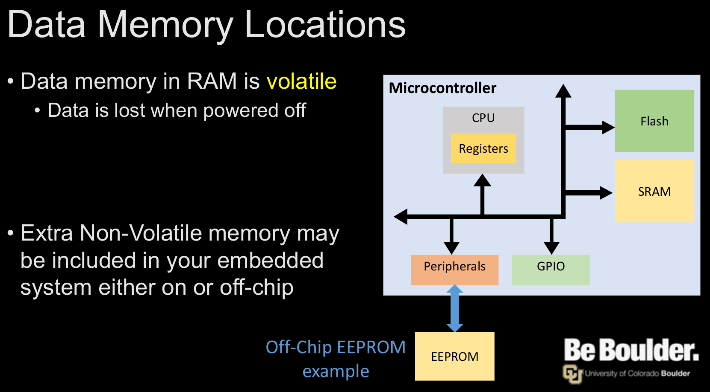
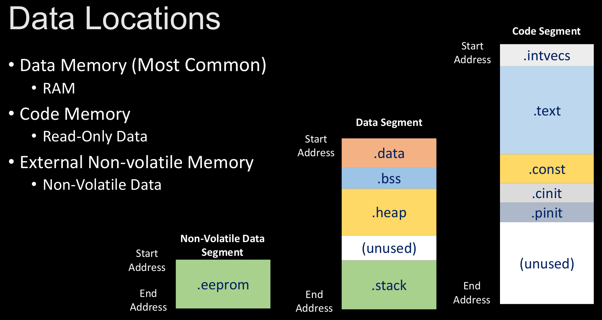

- For local variables that are initialized, their initial values are stored in the non-volatile memory and are copied to the RAM at the beginning of the program execution or the function.

## Special Keywords (Const, Extern, Static)
- We will discuss some special keywords that affect data allocation in the data segment, these include:
  - Variable types
  - Type qualifiers
  - Type modifiers
  - Storage classes
  
### Variable Types
- These tell the compiler exactly how much space does this data need to be stored, and in case of certain types (like float variable), how that data should be formatted
- Derived types like arrays and structures can be used but they are implementation-dependent, meaning that depending on the types they are defined with will affect the overall size
- Pointers and enumerated types have a size that is dependent on the architecture itself
- There are some special keywords for different C standards to define certain types like the Bool, Complex, and Imaginary in **C99**
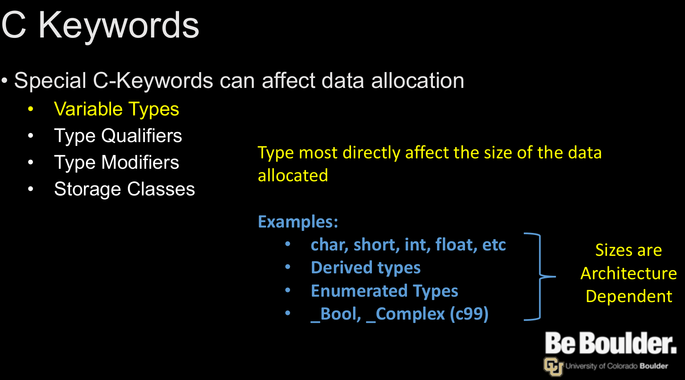

### Type Qualifiers
- The most important type qualifier in embedded systems is **const**
- Const keyword specifies that the associated data will be constant and will be stored in the **read-only memory**, so it can't be changed by the traditional methods
- This read-only data is stored in the **code memory** in the **.const (or .rodata)** subsegment
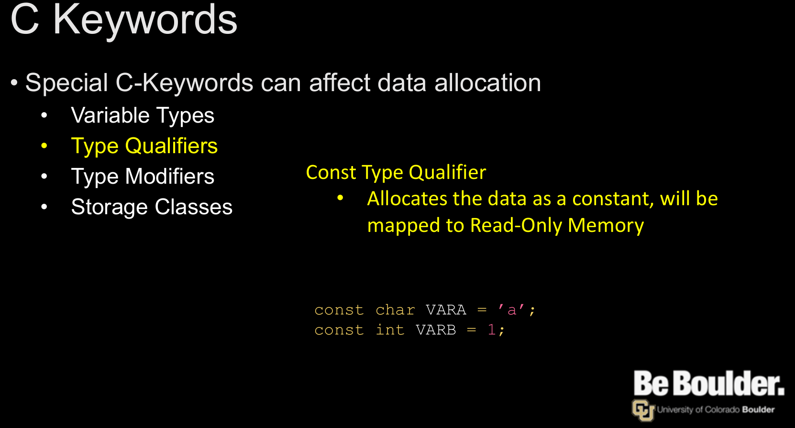
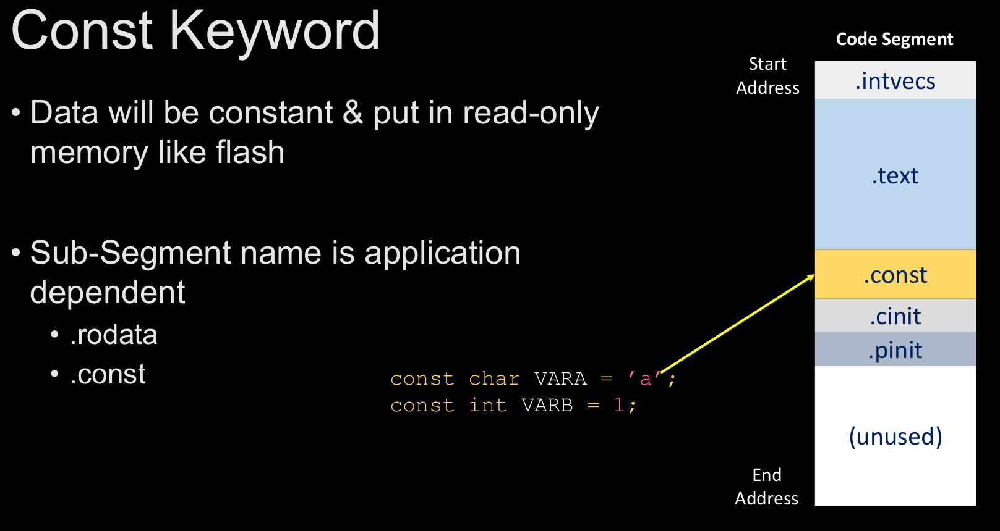

### Type Modifiers
- These type modifier may control the **size and the sign** of a particular datatype
- Altering the sign changes the range of values a datatype can represent
- Altering the size changes the size of memory that the datatype is allocated for, for example: the ARM architecture specifies that `short int` will occupy 2 bytes, a `long int` will occupy 4 bytes, and `long long int` occupy 8 bytes
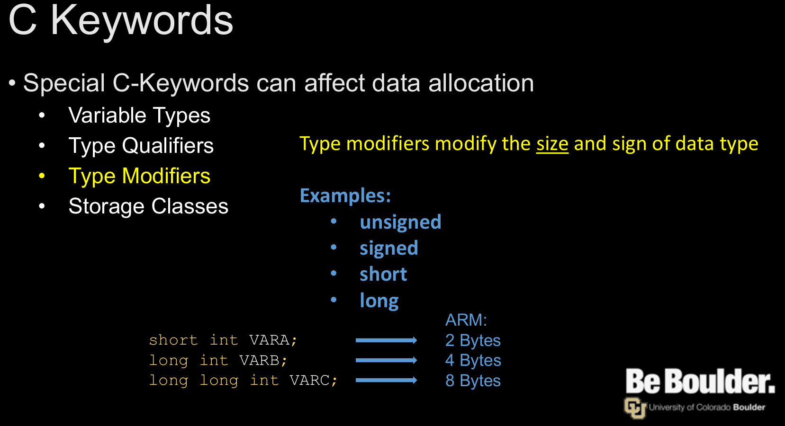

### Storage Classes
- These tell the compiler what the **lifetime and scope** should this data have in the program
- We've 4 storage classes: `Auto`, `static`, `extern`, and `register`.
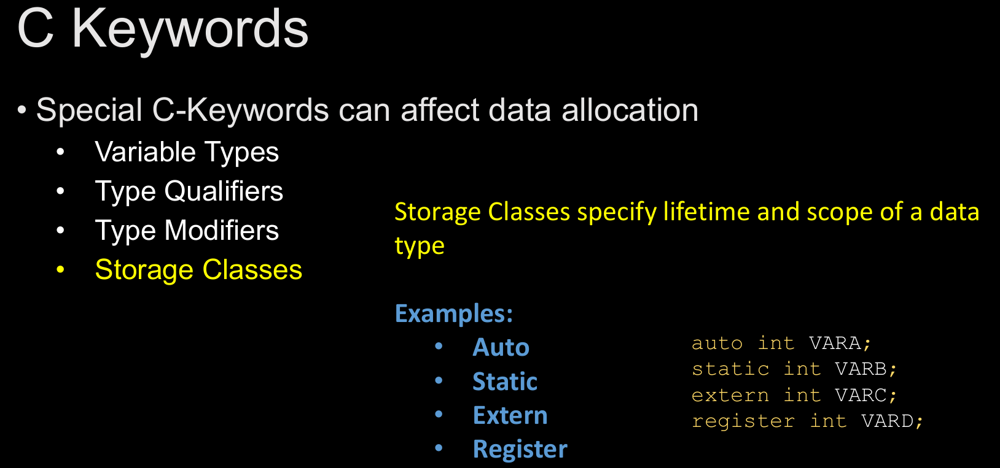

- The `auto` storage class is the default storage class for local variables, it tells the compiler to automatically allocate and de-allocate this data on the stack.
- It's trivial to write `auto` to our local variables as they are already auto by default.
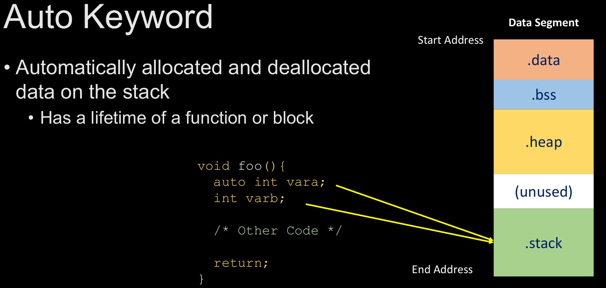

- The `static` keyword for variables tells the compiler that this data should **remain for the lifetime of the program** but the difference between the static variables and global variables is **the static variable is not accessible unless in its own function**, static data can be stored in the *.data* section if it's non-zero initialized or in the *.bss* if it's non-initialized or zero-initialized. (To sum up: static variable has a lifetime of a program but a local scope of access)
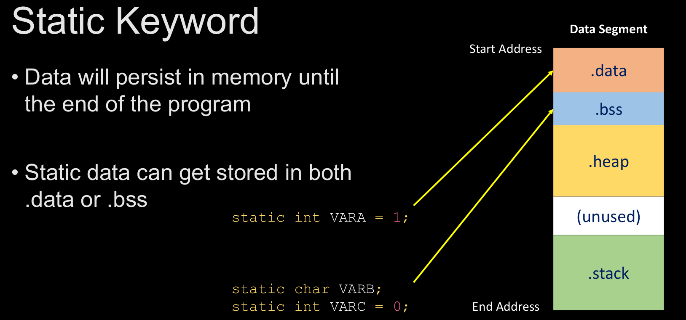

- The `static` funtion is a function that is not accessible outside its own file. (i.e.: we can't call it in another file)

- The `extern` keyword **allows for a variable definition to exist outside the current scope of access**, this means that a local variable can be externally defined in another file. Global variables are accessible by the file that has defined them, but if you want to use a global variable defined in another file we must provide the `extern` declaration of that variable so that the compiler knows that this variable is defined elsewhere
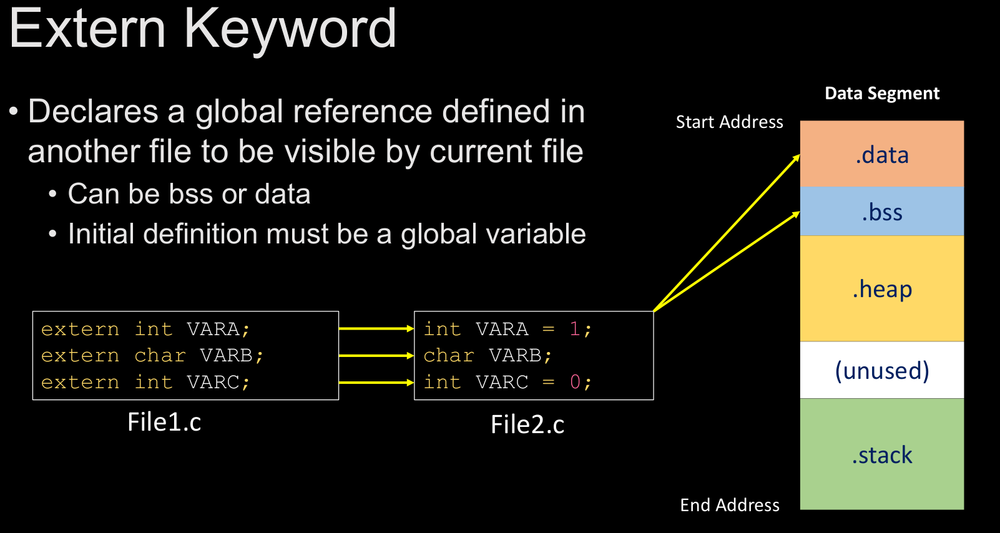

- The `register` keyword makes a request to the compiler to allocate this variable in the CPU registers as they are the fastest memory in our system. However, this is just a guideline for the compiler which the compiler can deny if it sees another operation needs to be put in this CPU register.
- This keyword is not used very commonly as the compiler usually can optimize the registers use better than a programmer.
- Some architectures like ARM will try to allocate a small number of local variables and funtion paramaters directly in the registers to reduce overhead associated with interacting with the stack.
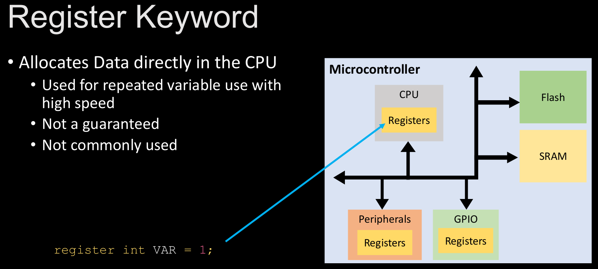

## The Stack
- The *.data* and *.bss* subsegments have data that **get allocated at compile time and exist for the lifetime of the program** 
- However, the stack subsegment **gets reserved at compile time but the data gets allocated at runtime**
- The stack is a space where temporary data is stored and the memory is reused over and over as the program executes 
- Stack requires some special management in order to accommodate the memory reuse, this is done either by the compiler at the time of build or directly by the programmer if they're writing the code in assembly
- The data is allocated and de-allocated automatically based on the architecture.
- Some general stack characteristics that are important to know:
  - Architecture specific stack instructions and registers
  - The direction of stack growth
  - The contents that are put into the stack
  - The order of the stack contents
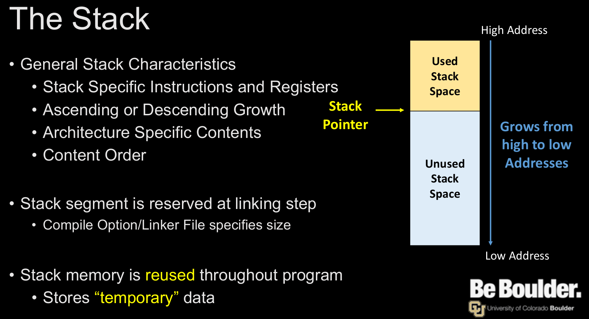

- The stack implementation is architecture dependent. Stack is primarily used for tracking the state of a program as routines are called and then returned (these routines include both program functions and interrupt service routines)
- The lifetime of data allocated in the stack will relate to the current scope of a routine, therefore as functions get called and returned these memory spaces are reused for various routines.
- All routines are application dependent, a programmer can nest routines with one another and the program has the ability to enter and return from each of these routines without affecting the calling routine's state.
- The method of how to pass data in and out of a routine is referred to as a *calling convention*. Tha calling convention should specify architecture specific concepts on how the CPU and stack are used.
- Calling conventions differ across architectures, for example: ARM architecture has different calling conventions from other RISC type processors
- The stack is used to allocate, save, and restore information for a calling convention
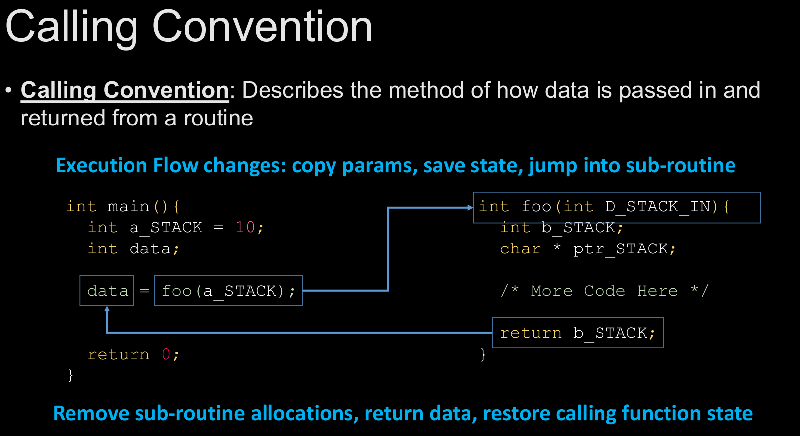

- *local variables*, *input parameters*, and *return data* are stored on the stack, the amount of theses data is dependent on the implementation of the routine
- In addition, other architecture specific items are stored in the stack just as a *copy of the used registers in the context*, *return address of the previous context*, *previous stack pointer*, and previous *special functions (interrupt routines) registers information*.
- Interrupt routines can happen asynchronously at any point during the program, therefore the microcontroller must be able to save and return to a previous CPU state at any point in time.
- When we these 2 groups of routine specific data and CPU state information, we obtain the *stack frame*.
- When more and more subsegments are nested within one another, new frames are added to the stack.
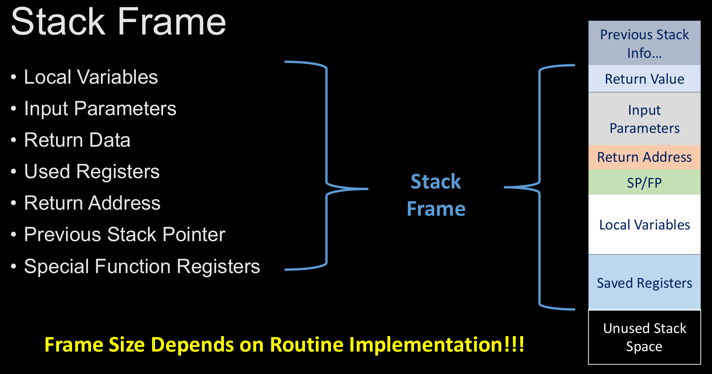

- Each new frame has data that is dependent on the implementation of the function and the current state of the CPU. As function returns, the frame data is removed, CPU state is restored and the code moves back to the previous calling function and its stack frame.
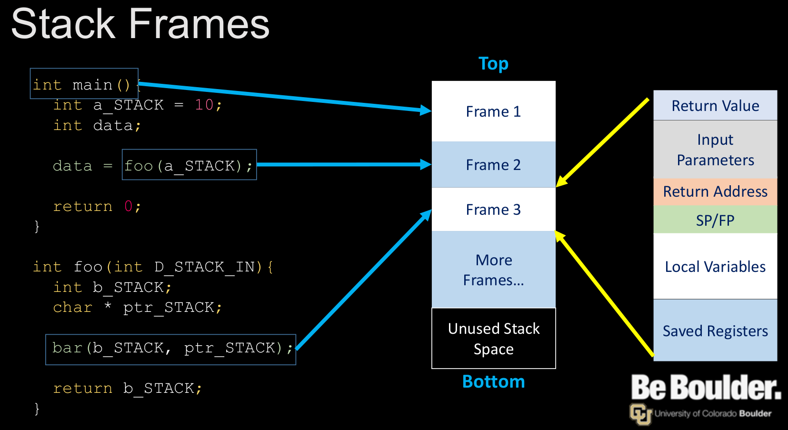

- Stack is reserved to be a specific size, this means that we can *overflow* the allocated stack region by writing code with a lot of nested functions, a lot of function parameters, and a alot local variables that might all occupy larger space than the stack's.
- Thus, we need to understand what an architecture's calling convention is in order to know how large a stack frame will be given for a function.
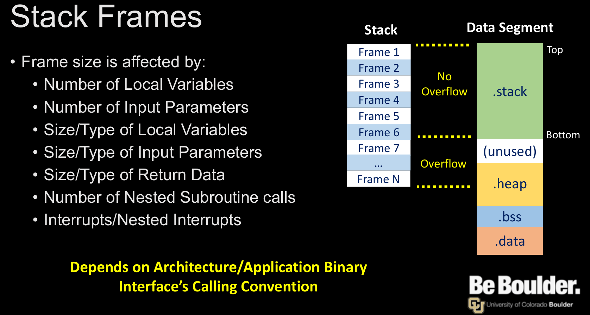

- Back to the ARM register memory, for our KL25z architecture we have 16 CPU registers and the CPU uses them to not only execute instructions but also to coordinate the calling convention of a routine:
  - Registers r0 to r3 are used to hold arguments that are passed into a function
  - Registers r4 to r11 are used to hold local variables
  - r13 holds the current stack pointer
  - r14 holds the return address for a function to return to
  - When a function is returned, the return data is put in the r0 register
- The size of these registers is architecture dependent, for our ARM architecture these are 32 bits each
- In addition to the previous registers, ARM has some other special purpose CPU registers that track and control the execution state, these include:
  - Program status register (PSR)
  - Exception mask registers (PRIMASK - FAULTMASK - BASEPRI)
  - Control register
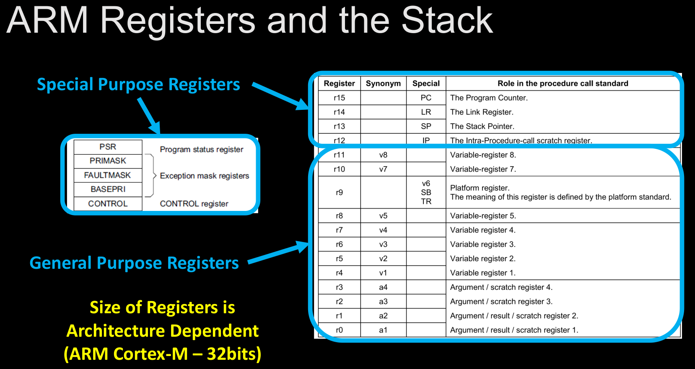

- After the previous discussion we might think that since the CPU general purpose registers are used to hold all of the input parameters, variables, and return data, so why do we even need the stack?
  - The answer is that we only have 12 GP registers, so they won't fit many input parameters, many local variables, large data types. So when the 12 registers are full, then the remaining data is allocated in the stack (i.e.: these registers are used to boost and improve the performance of the process of calling convention -as we don't need to load and store from memory- and we can't completely rely on it) 
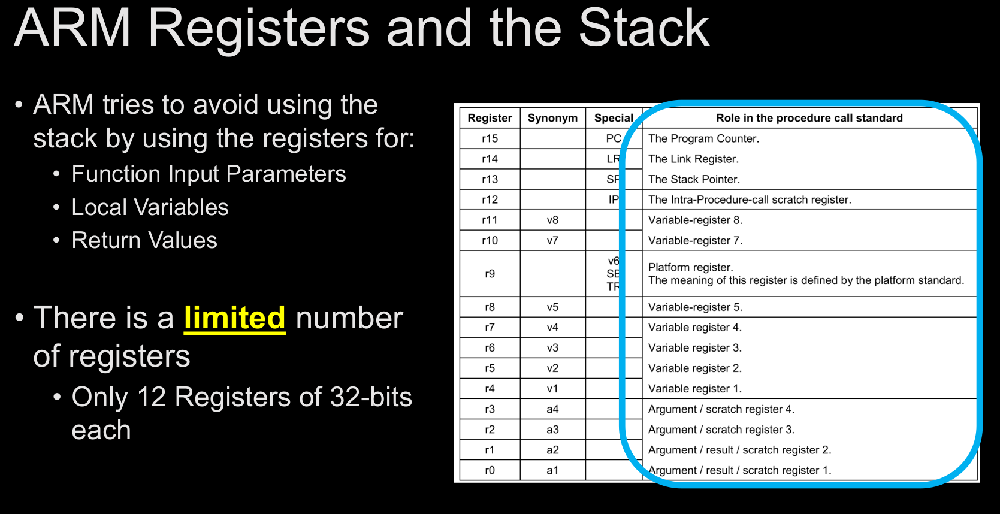

- As a new data is put in the stack, the *stack pointer* will move in one direction growing the stack, when data is removed the stack pointer will move the other direction and the stack will shrink
- The growing and shrinking of the stack occurs in the same end, with one end set firmly to a particular address.

- Stack is referred to as a LIFO data buffer, but it's specialized LIFO for the architecture's calling convention, also the stack implementation specifies the stack pointer will move upwards with address increaseing or downwards with adress descending to indicate stack grow. In our ARM architecture, stack is implemented as a *full descending stack* as the stack grows downwards to the lower addresses
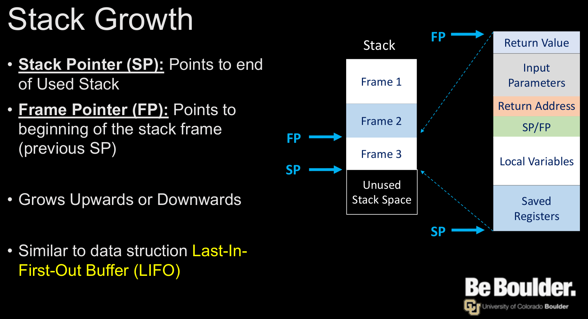

- To add and remove data to stack we use the special `push` and `pop` instructions. In some architectures, these are single instructions that push a single piece of information to or from the stack, in other architectures there may be a push or pop specialized instruction that can add or remove a particular set of registers to the stack.
  - For example, ARM has `load` and `store` instructions that can move multiple pieces of data to and from the stack
  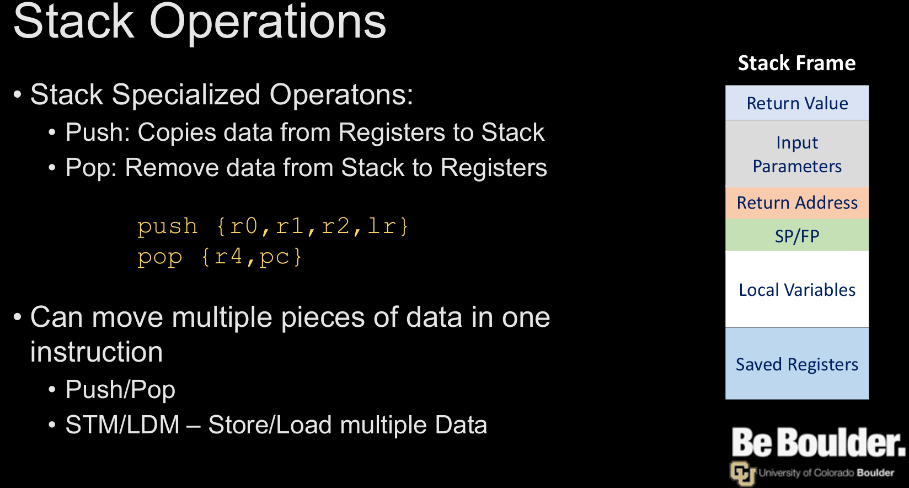

- We should be careful to limit the number of routines that are called, in addition to control how many are nested, this is because the stack is not of infinite size and one of the major problems in embedded systems is the stack overflow 
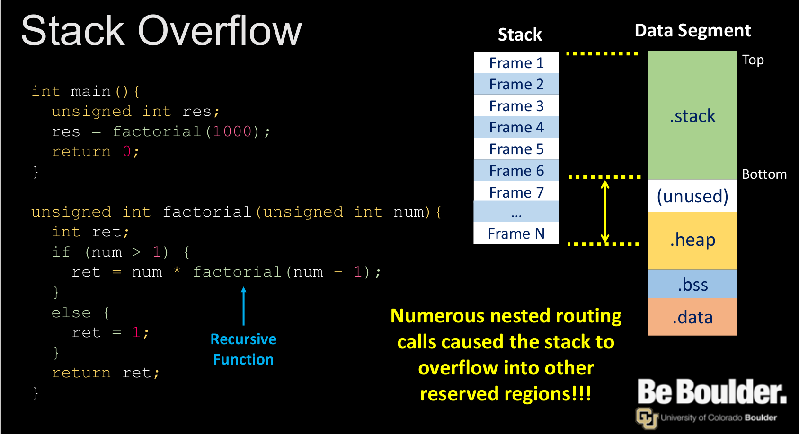

## The Heap
- Heap is used to allocate dynamic data at runtime.
- Just like the stack, heap is allocated and deallocated with software at runtime, the difference is that the heap allocation and deallocation is done manually by the programmer with the use of functions that manage the region.
- The lifetime of the heap data will exist for as long as the software designer has not deallocated that data
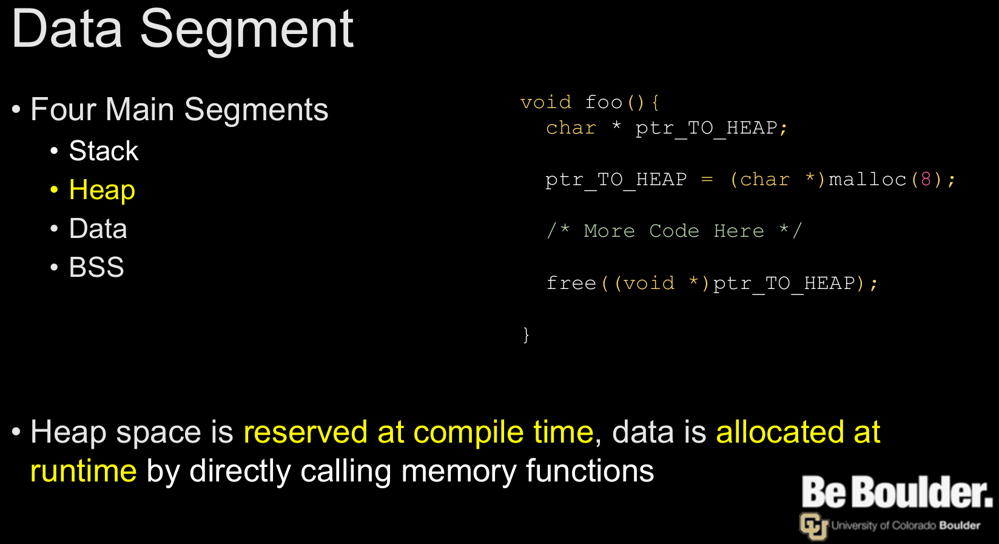

- Thanks to heap, we can -for each allocation- specify any number of bytes to reserve, we also can dynamically change the size of allocated data.
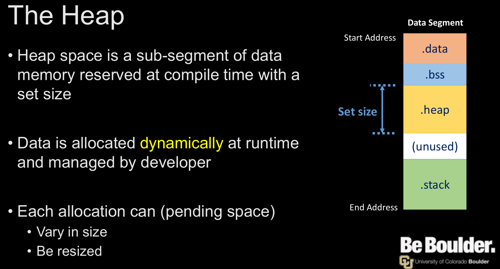

- Data that is reserved will remain reserved for as long as the programmer chooses. Allocated data can live for more than the function lifetime and shorter than the program lifetime.
- The process or reserving dynamic memory and free-ing it is extra overhead for a program to execute. The dynamic memory management is done in the form of software routines that check for available space in the heap region to place the requested allocation. This dynamic memory manager maintains a data structure to track the current state of the heap space
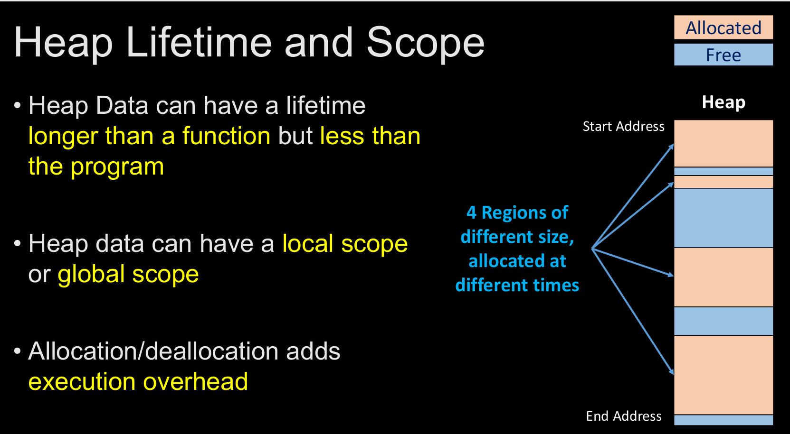

- We use specific heap functions to directly reserve and free data in the heap:
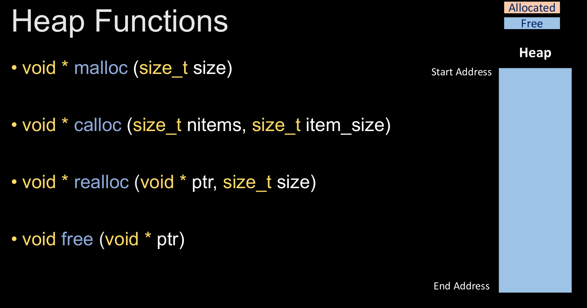

- `malloc` and `calloc`reserve a contiguous block of memory by specifying the number of bytes you want to reserve, this can be placed anywhere in the heap depending on the current active allocation as long as it doesn't overflow the heap region
- `calloc` does the same as `malloc` but `calloc` will additionally initialize this memory space with zeros.
- Once we have received a pointer from `malloc` or `calloc`, we should maintain and not change that address as this address will be used to track and free these allocations later.
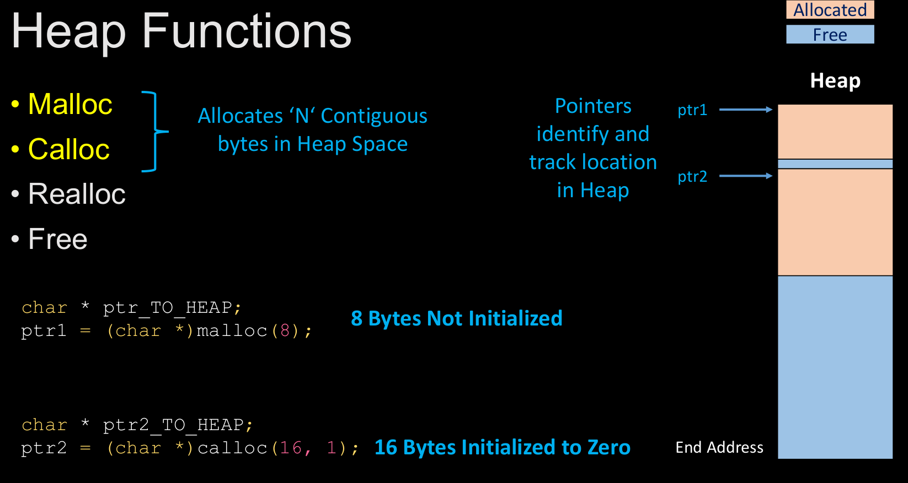

- `realloc` is the function that allows us to change existing allocation size, this function requires as inputs: the new size of memory that we wish to have, and the original heap pointer that we allocated from either malloc or calloc. `realloc` will return a pointer to the new memory region (this pointer may point to the same previous address or may be pointing to different address than the original pointer that we fed the function with .. this is based on whether the original address can handle the new space or not).
- In case `realloc` allocates space in different location, then it will automatically free the previous location.
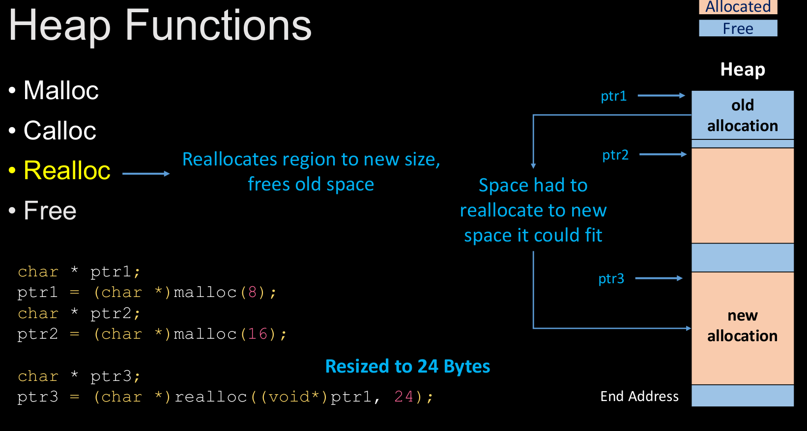

- All the previous heap functions require that we know exactly the memory size that we want to allocate and they return a pointer to the beginning of the allocated region, it becomes more challenging when we want to allocate some data structure as we will need some maths to calculate the exact size we want. However, the C operator `sizeof` can help with this as we give it a specific type or variable and it returns the number of bytes this variable will occupy in memory
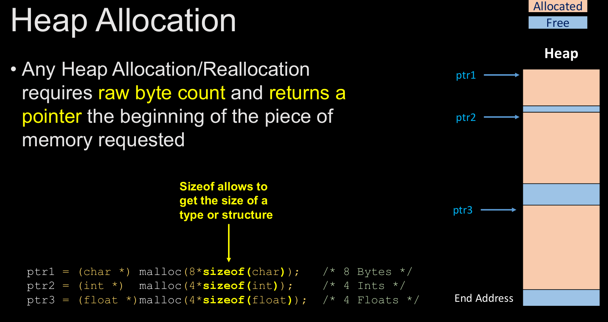

- The requested memory can be freed by the `free` function, all we need to do is to provide the pointer we are using to track that memory space as an input to the `free` function.
- We must free the memory space as we are done with it, otherwise the heap will have less space to work with and may cause heap overflow.
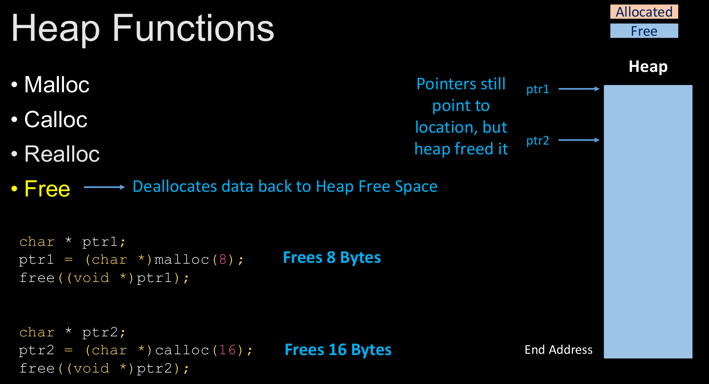

- All of the previous functions require the programmer to keep track of the allocated memory with a pointer to the starting address, this pointer must have a scope as long as the memory is being used. if the pointer is destroyed from the stack before the allocated heap space is freed, then this memory space is lost for the remainder of the program
- There is no guarantee that the space is successfully allocated as there may be not enough contiguous space remaining in the heap, We also can't know for sure by calculations as the heap region may be *fragmented*. If the allocation fails, these functions will return a NULL pointer, so we need to *assert* that the allocation process has been done successfully before proceeding with the program.
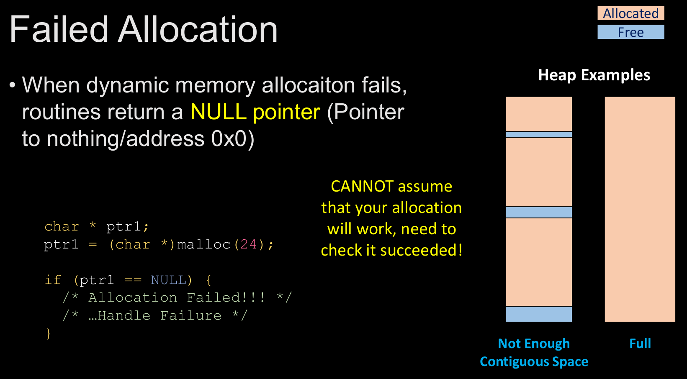

- Here is an example where we successfully reserve 8 bytes of data in the heap:

- And this is an example where the reserve process fails because of fragmentation: assume a heap space of 64 bytes with 2 allocations existing already, the first one is 16 bytes and the second one is 32 bytes and we have 16 free bytes.
- Now, we free the first 16 bytes so we now have 32 free bytes. But if we try to allocate new 32 bytes it will fail as the 32 already free bytes are not contiguous 
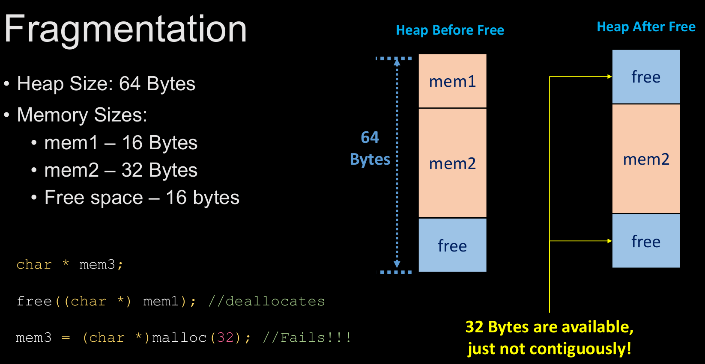

- Some embedded engineers advise not to frequently use dynamic memory allocation as it have some negatives regarding the memory and execution performance:
  - Constantly allocating and freeing memory will add excessive execution overhead to managing the heap region.
  - Heap can be fragmented, preventing us to use some available memory
  - Failure to free a piece of memory is knows as *memory leak* which may be happened if we lose track of the heap memory by using its pointer
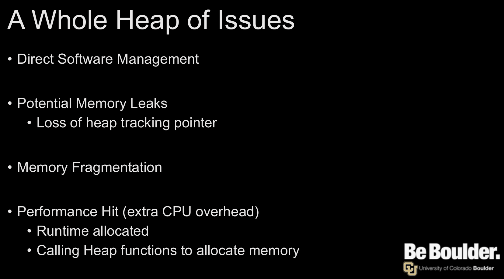

## Code Memory
- Just like the data segment, code segment is broken down into many subsegments that we will discuss in this lesson.
- The code segment represents the part of the compiled memory that contains all of the executable program, the code segment also stores a little bit of program data
- Code segment is put into the runtime read-only memories like *Flash*, this is done to protect the code from being accidentally overwritten and also for security reasons. Although it can be runtime writable even in flash but it requires extra interaction and permissions to write data depending on the implementation
- As we discussed before, code memory has more limitations than data memory like *latency* and *durability* but has a strong benefit of being *non-volatile* memory.
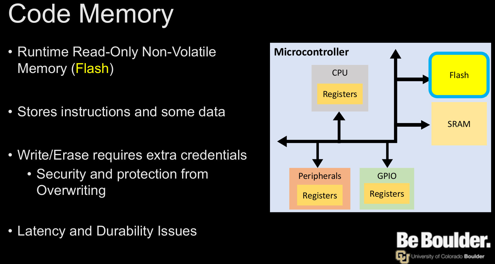

- The code memory subsegments are:
  - Interrupt vector table (.intvecs)
  - Constant (.const) or read only data (.rodata)
  - Initialization code (.cinit)
  - Bootloaders
  - Flash configuration
- As just as the data segment, the linker file specifies what physical memory the code segments map to, the subsegments -as we already know- get mapped continously into this region starting at the address 0x0 
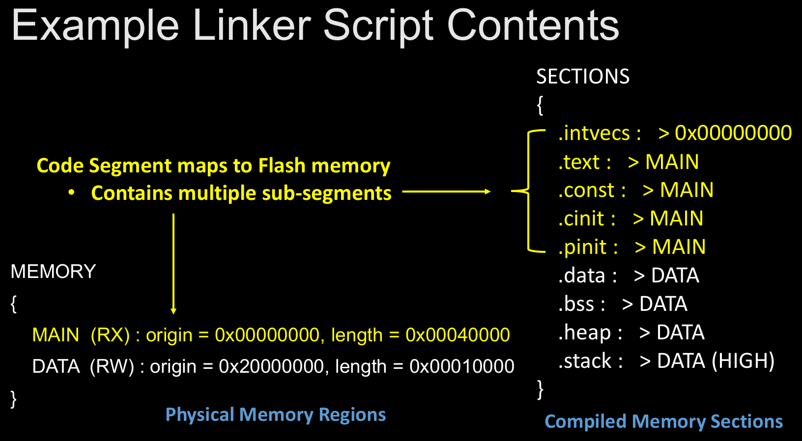
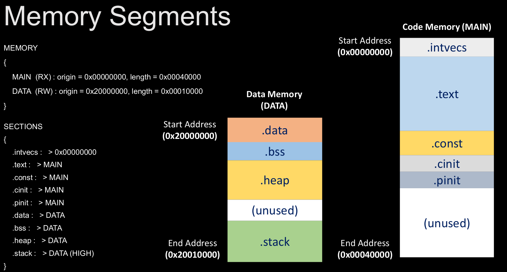

- The size of each subsegment is implementation dependent, either due to the architecture, compiler or the program itself
- The interrupt vector table represents a function address table that maps to specific addresses that represent the start of the interrupt service routines.
- So when the CPU needs to respond to an interrupt request, it will lookup this table and find where that function or ISR lives, then it jumps to that address
- In general, the vector table is put at address 0x0 and it's pretty standard, but this can be configured in ARM architecture
- The size of this subsegment is set based on the architecture as different architectures support different numbers of interrupts
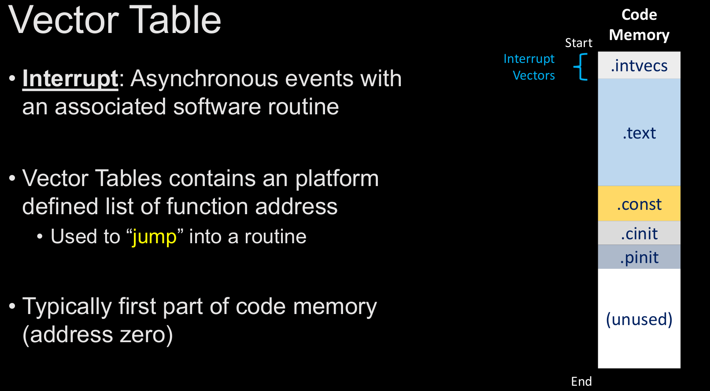
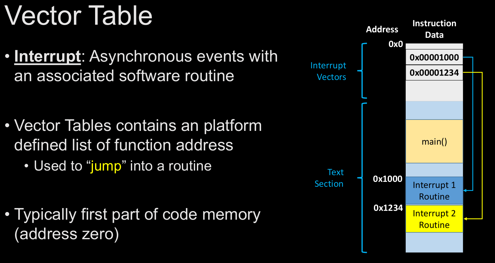

- The *.text* section represents all of our actual code that is compiled and stored, this includes the *main* function and all of the SW routines we write, in addition to many functions that get added from the C standard library (just as the startup code that calls the main function and what to do after returning from it)
- .text section size depends on how large our program is.
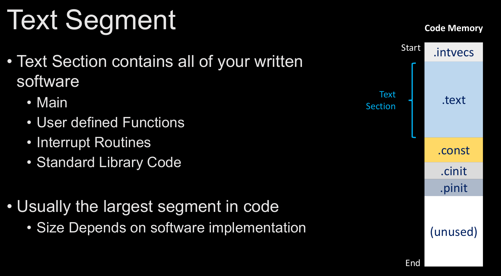

- The read-only data (.rodata) or the constant (.const) subsegment is where the *constant* variables are stored, we should not be able to modify the constant data, so we put them in this section so that if we try to overwrite this data, they fire a *processor exception* or the processor may neglect the operation (depending on the architecture). This is because the code memory requires extra interactions with the flash controller in order to write data into it
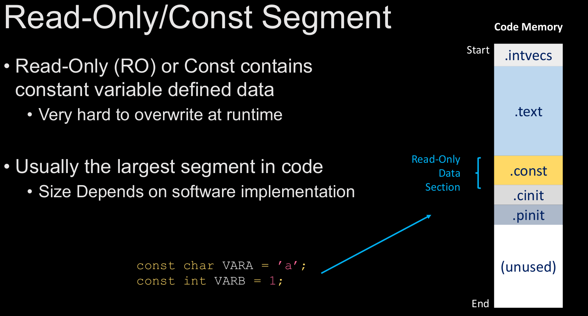

- The .pinit and .cinit subsegments are used at initialization, all of the initialzation data values are stored in non-volatile data memory until the program starts (this makes sense because if these data are stored in a volatile memory it will be lost once the power is removed) so they are stored in these subsegments and are loaded into SRAM everytime the application starts from power down
- This initialization process causes more overhead on the processor, as the initialization of data requires both the code memory allocated for the initial values and also the initialization process itself.
- Depending on the architecture and compiler, these sections may have different names or different implementations (these names are shown in the following picture)
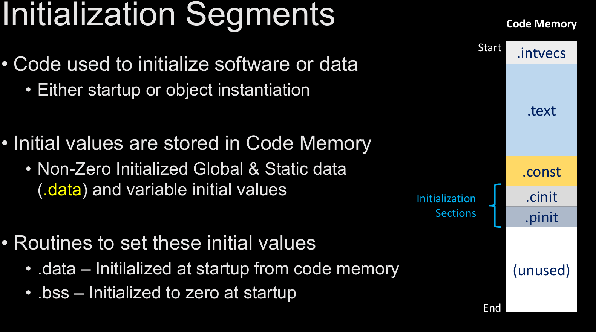
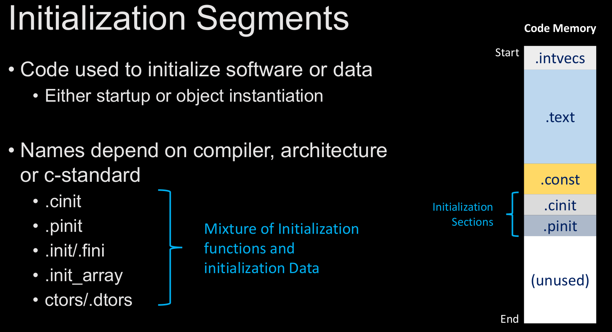

- The last subsegment we will discuss is the *bootloader (.bootloader)* and flash config.
- As discussed before, embedded systems need a method to install the executable on it, we can use *external program loaders* that connect directly to the processor but they are expensive and require extra hardware, some dev kits contain On-board processor to program the mcu through a cheaper much more standard interface like USB, these extra on-board processors are referred to as **external bootloader or flasher**.
- A third solution is that we reserve a small segment of the code memory to act as our installer, **this is our bootloader** which is a small program that at each reboot it looks for a signal on one of its communication interfaces signalling a program install, if it sees this signal, it overwrites the current flash memory with the new program, if it doesn't see this signal then it will just call the currently stored program and boots begin program execution as usual.
- The bootloader section helps reducing the amount of hardware required to install
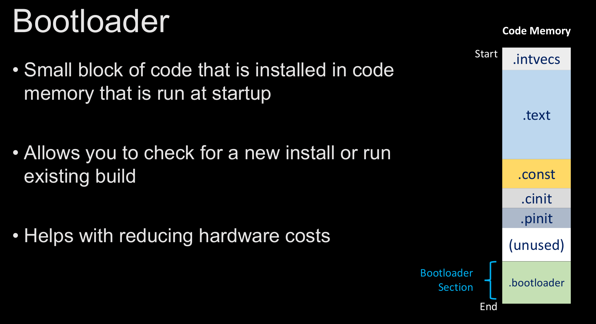

- We don't need to include all these segments and subsegments manually as the compiler will automatically use some C standard libraries during compilation to do this process.
- Ofcourse we can avoid the addition of these subsegments and write our own bare-metal C by firing the *no standard library (-nostdlib)* compiler flag, or by writing our own assembly code directly
- But since the compiler can provide us these operations so easily by defining what to do at startup and program termination, and how the segments and subsegments are mapped into memory, so it's not suggested to neglect all of these and write them from the beginning. The compiler can also automatically map unsupported operations for our architecture into equavalent software processes (which will be hard manually)
- More advanced architectures with embedded OS support allow for code memory to be written and installed while the processor is running.
